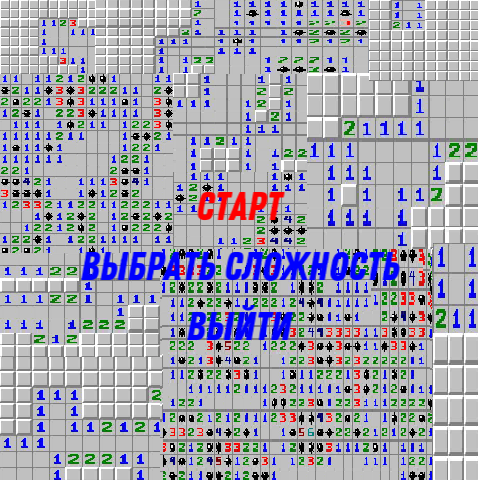
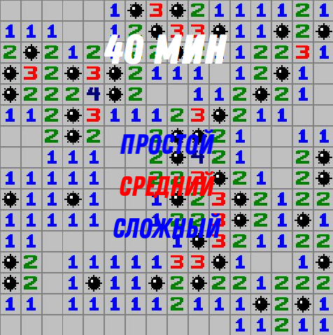
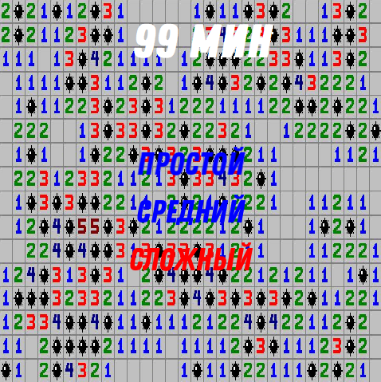
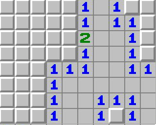
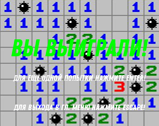
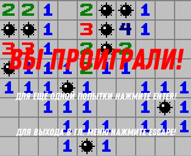

<h1>Руководство пользователя: Игра "Сапёр"</h1>

<h2>Назначение программы</h2>

Данное приложение представляет собой реализацию классической игры "Сапёр" на языке C++ с использованием графической библиотеки <strong>SFML</strong>. Игра позволяет пользователю тренировать внимание, логику и скорость принятия решений, открывая клетки игрового поля и избегая мин.

<h2>Функционал программы</h2>
<ul>
    <li>Графический интерфейс с использованием SFML</li>
    <li>Выбор уровня сложности</li>
    <li>Система победы и поражения</li>
    <li>Главное меню с навигацией</li>
    <li>Модульное тестирование (Doctest)</li>
    <li>Автоматическая генерация документации (Doxygen)</li>
    <li>Кроссплатформенная сборка через CMake</li>
</ul>

<h2>Установка программы</h2>

<h3>Предварительные требования</h3>
<ul>
    <li>Компилятор C++ с поддержкой стандарта <strong>C++17</strong></li>
    <li><strong>MinGW 13.1.0 (64-bit)</strong> — обязательная версия для Windows</li>
    <li><a href="https://github.com/brechtsanders/winlibs_mingw/releases/download/13.1.0-16.0.5-11.0.0-msvcrt-r5/winlibs-x86_64-posix-seh-gcc-13.1.0-mingw-w64msvcrt-11.0.0-r5.7z" target="_blank">Скачать MinGW 13.1.0</a></li>
    <li><strong>CMake</strong> версии 3.10 и выше</li>
    <li>Doctest (для модульных тестов)</li>
    <li>Doxygen (для генерации документации)</li>
</ul>

<h3>Клонирование репозитория</h3>
<pre><code>git clone https://github.com/mustafayevbst/minesweeper.git
cd minesweeper</code></pre>

<h2>Сборка проекта</h2>

<ol>
    <li>Создайте директорию для сборки:</li>
</ol>
<pre><code>mkdir build
cd build</code></pre>

<ol start="2">
    <li>Запустите CMake:</li>
</ol>
<pre><code>cmake ..</code></pre>

<ol start="3">
    <li>Соберите проект:</li>
</ol>
<pre><code>cmake --build .</code></pre>

<h2>Запуск программы</h2>

После сборки запустите исполняемый файл:

<pre><code>./minesweeper.exe</code></pre>

<h2>Основные сценарии использования</h2>

<h3>Главное меню</h3>

После запуска игры появляется главное меню с тремя пунктами:

<ul>
    <li><strong>Старт</strong> — начать игру;</li>
    <li><strong>Выбрать сложность</strong> — выбрать размер поля и количество мин;</li>
    <li><strong>Выйти</strong> — завершить работу программы.</li>
</ul>

<h3>Уровни сложности</h3>

На выбор игроку дается три степени сложности:

Простой(80 полей, 10 мин):

Средний(256 полей, 40 мин):

Сложный(480 полей, 99 мин):

<h3>Игровое поле</h3>

После выбора уровня сложности создаётся игровое поле. Игрок должен открывать клетки, избегая мин:

<h3>Победа</h3>

Игра завершается победой, если все клетки без мин открыты:

<h3>Поражение</h3>

Игра завершается поражением при открытии клетки с миной:

<h2>Пример кода (модуль Board)</h2>

<pre><code>// Board.h
#pragma once
#include <SFML/Graphics.hpp>
#include <vector>

enum class GameState {
    Playing,
    Lost,
    Won
};

class Board {
public:
    Board(int w, int h, int m, int tilesize);
    void reveal(int x, int y);
    void toggleFlag(int x, int y);
    void draw(sf::RenderWindow& window) const;
    int getTileSize() const;
    void placeMine(int x, int y);
    GameState gameState = GameState::Playing;
    void clickCell(int x, int y);
    bool checkWin() const;

private:
    int width, height, mines;
    std::vector<std::vector<char>> field;
    std::vector<std::vector<bool>> revealed;
    std::vector<std::vector<bool>> flagged;
    sf::Font font;
    int tileSize;
    sf::Texture tilesTexture;
    bool firstClick = true;

    void placeMines(int firstClickX, int firstClickY); 
    bool isInSafeZone(int x, int y, int safeX, int safeY) const;
    int countMines(int x, int y) const;
    void revealEmpty(int x, int y);
    GameState getGameState() const { return gameState; }
    void revealAll();
};

</code></pre>

<h2>Пример кода (модуль Game)</h2>
<pre><code>// Game.h
#pragma once

#include "Menu.h"
#include <SFML/Graphics.hpp>
#include "Board.h"

enum class GameScreen {
    MainMenu,
    DifficultyMenu,
    Playing,
    Exit
};

class Game {
public:
    Game(int sizeX, int sizeY, int minesCount);
    void run();
    int currentWidth_;
    int currentHeight_;
    int currentMines_;
    void resetGame();

private:
    void processEvents();
    void update();
    void render();
    void startNewGame(int width, int height, int mines);

    int tileSize_ = 32;
    Board board_;
    sf::RenderWindow window_;
    sf::Font font_;
    sf::Texture backgroundTexture_;
    sf::Sprite backgroundSprite_;

    sf::Texture simpleBgTexture_;
    sf::Texture mediumBgTexture_;
    sf::Texture hardBgTexture_;
    sf::Sprite simpleBgSprite_;
    sf::Sprite mediumBgSprite_;
    sf::Sprite hardBgSprite_;

    GameScreen currentScreen = GameScreen::MainMenu;
    Menu difficultyMenu_;
    Menu menu_;
};

</code></pre>

<h2>Генерация документации</h2>

Чтобы сгенерировать документацию с помощью Doxygen:

<pre><code>doxygen Doxyfile</code></pre>

<h2>Запуск модульных тестов</h2>

Запуск тестов осуществляется отдельной сборкой и запуском тестового проекта:

<pre><code>./tests/test_board.exe</code></pre>

<h2>Автор</h2>

<strong>mustafayevbst</strong>

</body>
</html>
